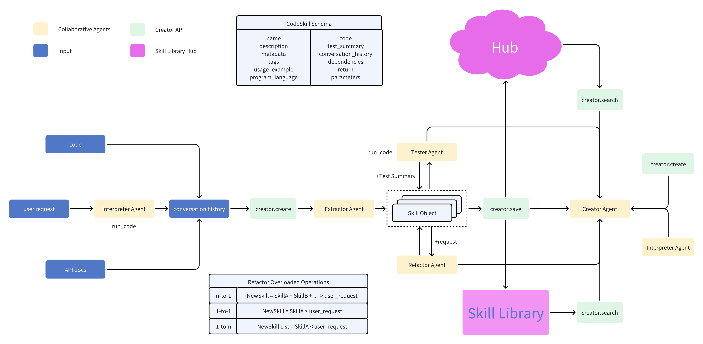

<h1 align="center">◓ Open Creator</h1>

<p align="center">
    <a href="https://discord.gg/eEraZEry53">
        
    </a>
    <a href="README_JA.md"></a>
    <a href="README_ZH.md"></a>
    
    <a href="docs/tech_report/open-creator.pdf"></a>
    <a href="https://huggingface.co/spaces/timedomain/skill-library-hub"></a>
    <a href="docs/api_doc.md"></a>
    <a href="[docs/api_doc.md](https://pepy.tech/project/open-creator)"></a>
    <a href="https://colab.research.google.com/github/timedomain-tech/open-creator/blob/main/docs/examples/08_creator_agent.ipynb"></a>
    <br><br>
    <b>Build your costomized skill library</b><br>
    An open-source LLM tool for extracting repeatable tasks from your conversations, and saving them into a customized skill library for retrieval.<br>
</p>

<br>

`open-creator` is an innovative package designed to extract skills from existing conversations or a requirement, save them, and retrieve them when required. It offers a seamless way to consolidate and archive refined versions of codes, turning them into readily usable skill sets, thereby enhancing the power of the [open-interpreter](https://github.com/KillianLucas/open-interpreter).




# Features
- [x] **Skill Library**: Efficiently save and retrieve structured function calls.
- [x] **Reflection Agent**: Automatically structures and categorizes your function calls.
- [x] **cache Chat LLM runs by using SQLite which is stored in `~/.cache/open_creator/llm_cache/.langchain.db`**: Save time and money by reusing previous runs.
- [x] **Sreaming**: Stream your function calls
- [x] **Community Hub**: Share and utilize skills from the wider community. Support [huggingface_hub](docs/skill-library-hub.md). `langchain_hub` not yet

# Updates
- [x] **2023-10-01**: Fix bugs and support tester agent and refactor agent
- [x] **2023-10-19**: Fix bugs and refact the project. Support
  - creator agent: `from creator.agents.creator_agent import open_creator_agent`
  - command lines: see help: `creator -h`; run as server: `creator server` and open `http://localhost:8000/docs`; streamlit demo: `creator ui` and open `http://localhost:8501/`
  - more documents:  [notebooks examples](docs/examples/01_skills_create.ipynb) and [API_DOC](docs/api_doc.md)


# Installation
```shell
pip install -U open-creator
```

# Usage

```python
import creator
```
## 1. Create a Skill
- [x] 1.1 from a request
- [x] 1.2 from a conversation history (openai messages format)
- [x] 1.3 from a skill json file
- [x] 1.4 from a messages_json_path
- [x] 1.5 from code file content
- [x] 1.6 from doc file content
- [x] 1.7 from file path
- [x] 1.8 from huggingface

1.1 Create a skill from a request
```python
request = "help me write a script that can extracts a specified section from a PDF file and saves it as a new PDF"
skill = creator.create(request=request)
```

1.5 Create a skill from code file content
```python
code_content = """
import json

def convert_to_openai_messages(messages):
    new_messages = []

    for message in messages:  
        new_message = {
            "role": message["role"],
            "content": ""
        }

        if "message" in message:
            new_message["content"] = message["message"]

        if "code" in message:
            new_message["function_call"] = {
                "name": "run_code",
                "arguments": json.dumps({
                    "language": message["language"],
                    "code": message["code"]
                }),
                # parsed_arguments isn't actually an OpenAI thing, it's an OI thing.
                # but it's soo useful! we use it to render messages to text_llms
                "parsed_arguments": {
                    "language": message["language"],
                    "code": message["code"]
                }
            }

        new_messages.append(new_message)

        if "output" in message:
            output = message["output"]

            new_messages.append({
                "role": "function",
                "name": "run_code",
                "content": output
            })

    return new_messages
"""
skill = creator.create(file_content=code_content)
```

1.6 Create a skill from doc file content
```python
doc_content = """
# Installation
\`\`\`shell
pip install langchain openai 
\`\`\`
The chat model will respond with a message.
\`\`\`python
from langchain.schema import (
    AIMessage,
    HumanMessage,
    SystemMessage
)
from langchain.chat_models import ChatOpenAI

chat = ChatOpenAI()
chat([HumanMessage(content="Translate this sentence from English to French: I love programming.")])
\`\`\`
you will get AIMessage(content="J'adore la programmation.", additional_kwargs={}, example=False)

We can then wrap our chat model in a ConversationChain, which has built-in memory for remembering past user inputs and model outputs.

\`\`\`python
from langchain.chains import ConversationChain  
  
conversation = ConversationChain(llm=chat)  
conversation.run("Translate this sentence from English to French: I love programming.")
\`\`\`
output: 'Je adore la programmation.'

conversation.run("Translate it to German.")

output: 'Ich liebe Programmieren.'
"""

skill = creator.create(file_content=doc_content)
```

1.7 Create a skill from file path
```python
skill = creator.create(file_path="creator/utils/partial_json_parse.py")
```

1.8 Create a skill from huggingface
```python
skill = creator.create(huggingface_repo_id="YourRepoID", huggingface_skill_path="your_skill_path")
```

## 2. Save a Skill
- [x] 2.1 Save to default path
- [x] 2.2 Save to specific skill path
- [x] 2.3 Save to huggingface

2.1 Save to default path
```python
creator.save(skill)
```

2.2 Save to specific skill path
```python
creator.save(skill, skill_path="path/to/your/skill/directory")
```

2.3 Save to huggingface
```python
creator.save(skill, huggingface_repo_id="YourRepoID")
```

```
Note: Before saving to Huggingface, you need to set up the authentication method for Huggingface.
It is recommended to use the user access token for authentication. Please follow the steps below:

1. Log in to your Huggingface account.
2. In the user menu in the top right corner, select "Settings".
3. In the left sidebar, select "API Tokens".
4. Click the "New Token" button to create a new access token.
5. Enter a descriptive name to help identify the purpose of this token.
6. Choose the appropriate access permissions, ensuring you have sufficient rights to upload and manage skills.
7. Click the "Create" button to generate the token.
8. Copy the generated access token and store it safely.
9. In the Terminal, enter: huggingface-cli login
10. Paste the access token you copied earlier and hit enter.
Now you can use this access token for authentication when saving and uploading skills. Ensure that before invoking the save function, set the access token as the environment variable HUGGINGFACE_TOKEN, so the API can use this token for authentication.
```


## 3. Search skills

- [x] 3.1 Local Search

3.1 Local Search
```python
skills = creator.search("your_search_query")
for skill in skills:
    print(skill)
```

## 4. Use a skill
- [x] 4.1 Use a skill by input args
```python
from rich import print
skill = creator.search("pdf extract section")[0]
input_args = {
    "pdf_path": "creator.pdf",
    "start_page": 3,
    "end_page": 8,
    "output_path": "creator3-8.pdf"
}
skill.show()
resp = skill.run(input_args)
print(resp)
```

- [x] 4.2 use a skill by request
```python
request = "extract 3-8 page form creator.pdf and save it as creator3-8.pdf"
resp = skill.run(request)
```

# Contributing
We welcome contributions from the community! Whether it's a bug fix, new feature, or a skill to add to the library, your contributions are valued. Please check our [Contributing Guidelines](CONTRIBUTING.md) for guidelines.

## License

Open Creator is licensed under the [MIT](./LICENSE) License. You are permitted to use, copy, modify, distribute, sublicense and sell copies of the software.
<br>


# Reference
> [1] Lucas, K. (2023). open-interpreter [Software]. Available at: https://github.com/KillianLucas/open-interpreter

> [2] Qian, C., Han, C., Fung, Y. R., Qin, Y., Liu, Z., & Ji, H. (2023). CREATOR: Disentangling Abstract and Concrete Reasonings of Large Language Models through Tool Creation. arXiv preprint arXiv:2305.14318.

> [3] Wang, G., Xie, Y., Jiang, Y., Mandlekar, A., Xiao, C., Zhu, Y., Fan, L., & Anandkumar, A. (2023). Voyager: An Open-Ended Embodied Agent with Large Language Models. arXiv preprint arXiv:2305.16291.

# Paper and Citation

If you find our work useful, please consider citing us! 

```bibtex
@techreport{gong2023opencreator,
  title = {Open-Creator: Bridging Code Interpreter and Skill Library},
  author = {Gong, Junmin and Wang, Sen and Zhao, Wenxiao and Guo, Jing},
  year = {2023},
  month = {9},
  url = {https://github.com/timedomain-tech/open-creator/blob/main/docs/tech_report/open-creator.pdf},
}
```

<picture>
  <source media="(prefers-color-scheme: dark)" srcset="https://api.star-history.com/svg?repos=timedomain-tech/open-creator&type=Date&theme=dark" />
  <source media="(prefers-color-scheme: light)" srcset="https://api.star-history.com/svg?repos=timedomain-tech/open-creator&type=Date" />
  
</picture>
