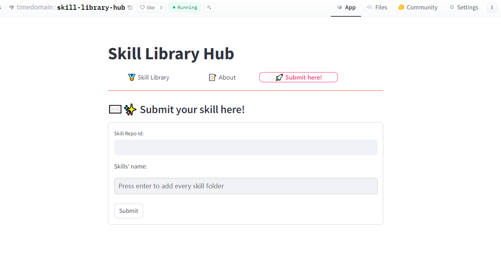

# Skill Library Hub

You can find skills shared by other users at [skill-library-hub](https://huggingface.co/spaces/timedomain/skill-library-hub), or submit locally saved skills to share with other users.

## Submit Skill

1. Switch to the Tab of **Submit here!**
2. Enter the repo id of your skill-library space, such as "timedomain/skill-library"
3. Enter the skill name and press the Enter key. You can enter multiple skill names. Press the Enter key each time to confirm.
4. Click Submit to submit

